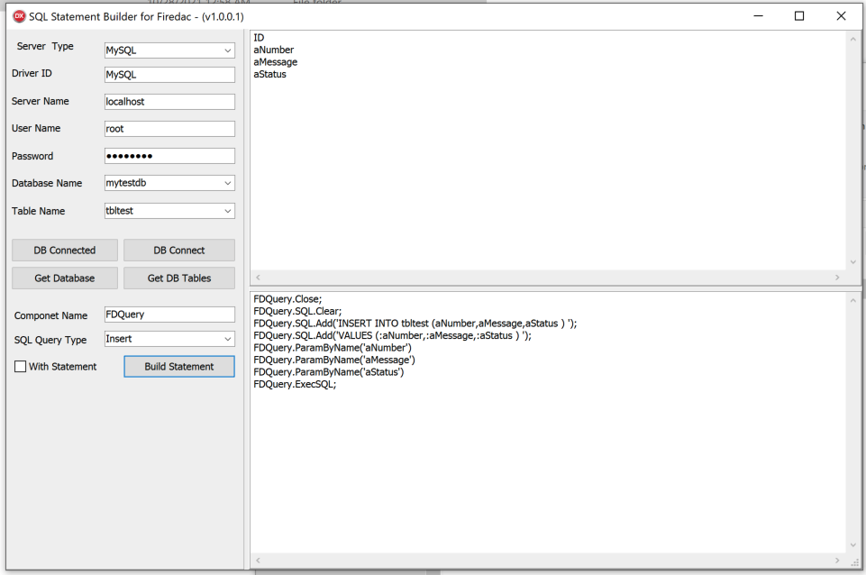

# SQLStatementBuilderByFireDAC
## A SQL Statement Builder with FireDAC in Delphi

Usually, it takes a lot of time to write parameterized SQL insert and update queries in Delphi. I wrote SQLStatementBuilderByFireDAC utilities which saved a lot of time for writing the insert and update query.

You can download the latest release, test and speed up your database application production.

### Samples
Check out latest release. If you have any questions or suggestion, please contact, make your pull request or create an issue.

### Version History
* 1.0.0.1
        * GUI with splitter added with new layout
        * Support for MySQL insert and update query
* 1.0.0.0
        * Initial Release
